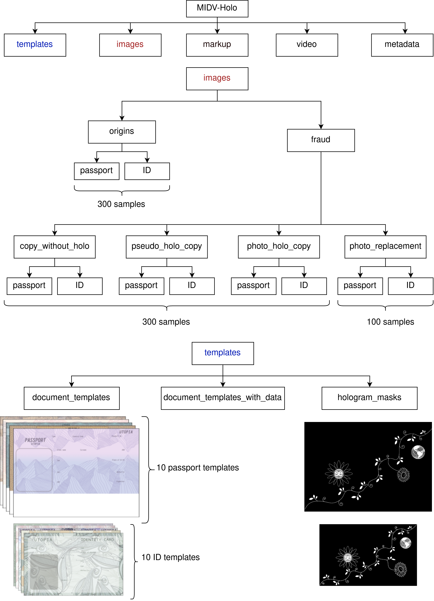

## MIDV-Holo: a dataset for ID document hologram detection in video stream

#### Description

This dataset contains clips with documents (passports and ID cards) of country “Utopia” (Only artificial documents for ethical reasons were used, and thus “Utopia” as a common name for a fictional country was applied). There are 700 clips in total. The dataset was produced to facilitate objective
and productive research on the topic of automatic hologram detection in video stream.

#### Dataset structure:

The directory `video` contains clips captured using Iphone 12 and Samsung Galaxy S10 in various of lightning conditions which include:

    A: office lighting, avoiding glare on the surface of the document while video shooting;

    B: office lighting;

    C: lighting of the flashlight of a mobile device, avoiding glare on the surface of the document while video shooting;

    D: lighting of the flashlight of a mobile device;

    E: outdoor lighting.

Detailed information about video shooting condition for each clip is located in directory `metadata` in the following JSON format: lighting condition code (letters from A to E) - mobile device name - list of the paths to clip directories.

The directory `images` contains clips splited into frames. FFmpeg version 4.2.7-0ubuntu0.1 was used: `ffmpeg -i CLIP -qscale:v 1 -vf "fps=5" DIR/img_%4d.jpg`

There are 5 types of documents presented:

* “original” documents: documents of country “Utopia” with holographic patterns: `images/origins`;
* threat model: copy of a document template without hologram: `images/copy_without_holo`;
* threat model: copy of a document template with drawn in an image editor hologram pattern: `images/pseudo_holo_copy`;
* threat model: printed photo of “original” document: `images/photo_holo_copy`;
* threat model: an “original” document with replaced photo of document holder: `images/photo_replacement`;

The set of the “utopian” document blanks that were used to produce documents for datatset is presented in directory `templates/document_templates`. It includes 10 unique passport blanks and 10 unique ID card blanks. The set of the “utopian” document templates with artificial data that were printed for dataset is presented in directory `templates/document_templates_with_data`.

The name of the clip is formed as follows: first chunk is the unique identifier of a document, second chunk is the index number of the document of this particular type and the last chunk is the index number of the clip. For example, the directory with the path `images/origins/passport/psp05_01_02` contains clip with the first “original” document of the type `templates/document_templates/passport_type_5.png`.

The hologram masks (Binary images that represent location of holographic patterns on the “original” documents) for ID cards and for passports are located in directory `templates/hologram_masks`.

The directory `markup` contains annotation for each frame in JSON format. Annotation includes manually selected document boundary quadrangle and the unique identifier of a document type. 



#### Installation:

The dataset can be downloaded from the link: [ftp://smartengines.com/midv-holo](ftp://smartengines.com/midv-holo)

#### License:

This work is licensed under the Creative Commons Attribution-ShareAlike 2.5 Generic License. To view a copy of this license, visit http://creativecommons.org/licenses/by-sa/2.5/ or send a letter to Creative Commons, PO Box 1866, Mountain View, CA 94042, USA.

The images of faces were obtained using Generated Photos (https://generated.photos/), the users are encouraged to include the Generated Photos attribution in any derivative works.

#### Authors:

 - Leisan Koliaskina
 - Ekaterina Emelianova
 - Daniil Tropin
 - Vladimir Popov
 - Konstantin Bulatov
 - Dmitry Nikolaev
 - Vladimir V. Arlazarov

#### Citing work 
If you end up using midv-holo dataset or results in your research, please consider citing:
``` bash
@inproceedings{koliaskina2023midv,
  title={MIDV-Holo: A Dataset for ID Document Hologram Detection in a Video Stream},
  author={Koliaskina, LI and Emelianova, EV and Tropin, DV and Popov, VV and Bulatov, KB and Nikolaev, DP and Arlazarov, VV},
  booktitle={International Conference on Document Analysis and Recognition},
  pages={486--503},
  year={2023},
  organization={Springer},
  doi={https://doi.org/10.1007/978-3-031-41682-8_30}
}
```

For any questions or suggestions, please don't hesitate to contact Leisan Koliaskina (l.gabdrakhmanova@smartengines.com) or Konstantin Bulatov (kbulatov@smartengines.com)
